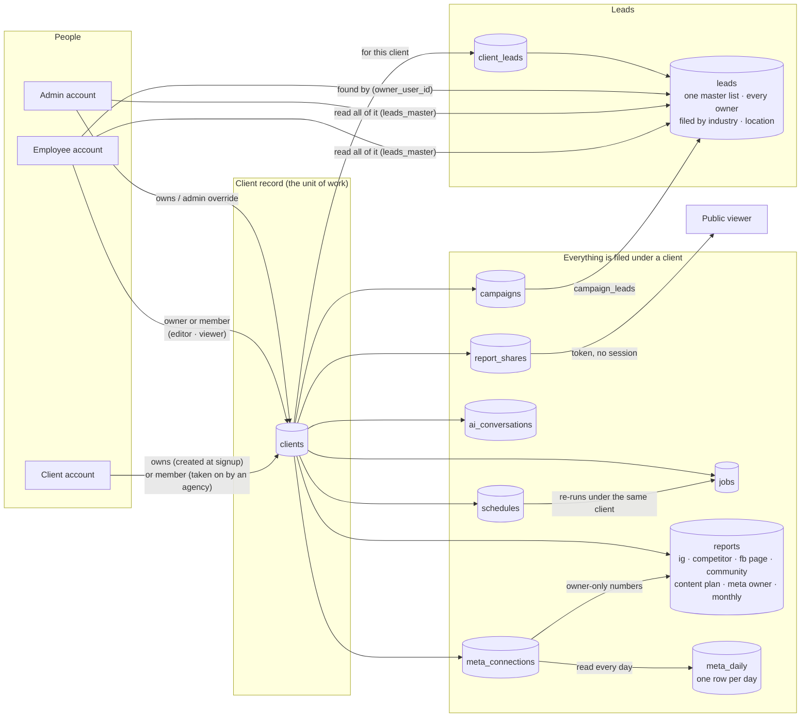

# EdgeLead — the use-case model

Who uses this product, what each of them is trying to do, how the pieces connect, and — measured,
not claimed — how much of it is proven.

The status column is the point of this document. It means one specific thing per row:

| Mark | Meaning |
|---|---|
| **E2E** | Walked end to end by `tests/usecases.test.js` — real route handlers, in-memory database, the actor's own token |
| **UNIT** | The logic is covered by a phase test; the workflow around it is not |
| **BUILT** | Implemented and wired (the audit proves reachability), but no test exercises it as a flow |
| **LIVE-ONLY** | Can only be proven against the real deployment (`scripts/live-checks.js`, or Apify / Meta credit) |
| **PARTIAL** | Some of the use case exists |
| **NOT BUILT** | Nothing exists; the row says why |

---

## The actors

| Actor | Who they are | What they hold |
|---|---|---|
| **Admin** | Runs the agency's installation | Every engine, every client, the keys, the limits, the accounts |
| **Employee** | Works on the clients they are assigned to | The engines an admin granted; their own Apify key or the pool, per admin setting |
| **Client — trial** | Signed themselves up; 7 days | The trial engines, itemised caps and a dollar ceiling, the shared pool |
| **Client — paid** | Activated by an admin | Monthly caps; the same client surface |
| **Client — lapsed / suspended** | Trial ended, or disabled | Nothing; refused at the door with a code the page acts on |
| **Public viewer** | Someone holding a share link | One report, read-only, until the link expires or is revoked |
| **Scheduler** | The system, on a timer | Repeats a saved run under the client it was created for |

---

## How the pieces connect

Every arrow is a real column or link table. Nothing here is a concept the code does not have.

Three rules the arrows enforce:

1. **A run with no client is refused** (`400 client_required`). A client account is its own business
   and never has to choose; everyone else must. This is server-side; the pages only point at the
   picker.
2. **Scraped and owner-side numbers never blend.** Every report row carries its source; the monthly
   report and the owner assistant read Meta only; the audits read scraped data only.
3. **Access is by client, checked at every route.** Owner, member, or admin — `clientAccess` — and
   the public share link is the single deliberate exception, gated by its token.
4. **One master list.** Every lead anyone collects lands in `leads`, filed by industry and location.
   Admins and employees read all of it through `leads_master` (one row per business, saying who
   found it); a client account reads only its own rows, however it asks.

---

## Admin

| # | Use case | Status | Proof / where |
|---|---|---|---|
| A1 | First account to sign in becomes admin (bootstrap) | **E2E** | `usecases` — *an agency starts up* |
| A2 | Create an account as employee, client or admin | **E2E** | `usecases` — *the admin provisions people*: the new hire signs in and sees exactly the engine granted; the walk-in client sees a trial and an allowance |
| A3 | Grant engines per employee; refuse an ungranted engine at its route | **E2E** | `usecases` — a grant added later shows on the next request; an ungranted engine is 403 at the route, not hidden in the page |
| A4 | Set trial length, trial caps, monthly caps — and have them bite; set the contact email, the ways to pay, and the agency's Gmail | **E2E** | `usecases` — *the admin moves a limit, and it moves*: a changed cap is enforced on the client's very next request; contact and payment details are readable with no session, a bad address or a `javascript:` link is refused. Mail: A14 |
| A13 | See the business in five numbers — on trial, ending this week, waiting to continue, paying, lapsed | **BUILT**, rendered | admin.html People; computed from the same rows the buckets draw; verified in a harness with every state present |
| A5 | Activate a paying client, set expiry, plan label; see who is waiting to be | **E2E** | `usecases` — *the money moment*: activation answers the request, evicts the stale auth cache, and the admin's pending count falls; the Admin nav carries the count |
| A6 | Create a client record | **E2E** | `usecases` — *the admin creates a client* |
| A7 | Assign an employee to **any** client, including one an employee created | **E2E** | `usecases` — *the admin can hand out work on a client an employee created* |
| A8 | See every client, with Meta connected / not | **E2E** | `usecases` — *the client row says whether Meta is connected* |
| A9 | Merge two records for one business | **E2E** | `usecases` — *one business, one record* |
| A10 | Manage Apify keys, the shared pool, Gemini keys | **BUILT** | admin.html *Apify keys*; phase-11 unit tests on key resolution |
| A11 | Check real Apify cost against the estimates; rotate the encryption key | **BUILT** (ops-only) | `docs/OPS-ENDPOINTS.md` |
| A12 | Watch spend and health | **BUILT** | admin.html *Spend & health*, `/api/admin/metrics` |
| A14 | Send mail from the agency's own Gmail — a new trial and a request to continue reach the agency; an activation reaches the client | **E2E** | `usecases` — *email goes out from the agency's own Gmail*: the app password is saved sealed and never comes back to a browser; a test message goes through Gmail with the saved credentials; the three messages arrive with the right words; when Gmail refuses, the admin sees why and the client's request still succeeds; with nothing set up, nothing is attempted |

## Employee

| # | Use case | Status | Proof / where |
|---|---|---|---|
| E1 | See the clients I am assigned to | **E2E** | `usecases` — *the employee sees the client they were assigned* |
| E2 | Choose which client a run is for; be refused without one | **E2E** + rendered | `usecases` — *with no client chosen, a run is refused*; work-for bar verified in all three states |
| E3 | Run any granted engine — IG audit, competitor intel, FB page report, community audit, post advisor, content plan | **BUILT** / **LIVE-ONLY** | 13 workers, every one wired to a route and a page (audit); the run itself needs Apify credit |
| E4 | Find Instagram leads (five methods) and have them filed under the client | **E2E** (link) / **LIVE-ONLY** (search) | `usecases` — *for this client, these are the leads*; the worker links via `linkLeadsToClient` |
| E5 | Find Facebook Page leads | **BUILT** | Lead List → *Find Facebook Pages*; phase-16 unit tests on the row shape |
| E6 | Read the **one** master list — every lead anyone here found, one row per business, filed by industry and location; narrow to mine; export it | **E2E** | `usecases` — *one master list for the whole agency*: two people finding the same business is one row that says who found it and how many did; an employee reads the same list an admin does; rows that only know their own category and city are still found by industry; a client account never sees it however it asks; the export carries industry, location and who found it. *The export never hands a spreadsheet a formula*; `phase20` for the sort whitelist |
| E7 | See **this client's** leads, found by anyone, one row per business | **E2E** | `usecases` — client view, colleague's find, de-duplication, stranger refused, export follows scope |
| E8 | Connect Meta as the client's Business Suite manager; turn a Page into a client | **E2E** (onboarding) / **LIVE-ONLY** (the OAuth handshake) | `usecases` — *an employee onboards a client from Business Suite*: unfiled Page → client with nothing retyped → filed, twice refused, colleague refused. The handshake itself needs a Tester role on the Meta app |
| E9 | Build the monthly owner report, this month against last | **E2E** | `usecases` — *the monthly owner report, against a scripted Graph API*: queued under the client, finishes, deltas exact (47.2% up; zero last month reads "new", never a percentage; a 0.6% move reads "flat"), only the month's posts counted, the analyst reads the same numbers back |
| E10 | Ask the analyst about one client only | **E2E** | `usecases` — *the analyst answers about one client only*: the model is scripted, and the test reads what the server actually sent it — the tool result held only that client's reports, the prompt named the client and the scope, a thread will not take a turn about another client |
| E11 | Discover comparable local businesses; keep a stable comparison set | **UNIT** | `phase19` — size band, query shape |
| E12 | Write a content plan; add manual audit findings; only proven cells may be boosted | **E2E** | `usecases` — *the content plan, with the model told to overspend*: a real plan from stored rows (zero credit); the model, answering from the scorecard the server built, claims "worth boosting" on every cell and invents one; the run downgrades every gap, keeps every proven cell, strips the spending rationale, drops the invention; the client reads it as ideas. `phase17` covers the gate in isolation |
| E13 | Share a report by link; revoke it | **E2E** | `usecases` — *a report goes out to someone with no account* |
| E14 | Repeat a run on a schedule, under its client | **E2E** (create, list, pause, delete; carries the client) / **LIVE-ONLY** (the timer firing) | `usecases` — *a run is repeated on a schedule, under its client*; `phase11` for next-run arithmetic |
| E15 | Bring my own Apify key; pause instead of using the pool | **E2E** (the own-key-only setting) / **BUILT** (the key itself) | `usecases` — own-key-only sticks; sidebar *Update key* |

## Client

| # | Use case | Status | Proof / where |
|---|---|---|---|
| C1 | Sign up → 7-day trial → I am my own business from the first login | **E2E** | `usecases` — *a business signs itself up* |
| C2 | See my reports in owner language — Instagram banded and ranked; Facebook, owner and monthly reports as headline, what is working, what to change | **E2E** | `usecases` — *the client surface names every kind of report*: titles for every stored type; a Page report and a monthly report open as points, with no invented standing; an Instagram report still bands and ranks |
| C3 | Draw a limited number of leads; audit a limited number of groups; stay under a dollar ceiling | **UNIT** | `phase13` — 32 checks on caps, periods, refunds |
| C4 | Ask the Owner Assistant — XpulseAI's, copied in whole: its warehouse of my own Meta numbers, its nineteen SQL-backed tools, its persona, its figure panels, its streamed answer; fed by the connection my agency made here | **E2E** | `usecases` — *the Owner Assistant (XpulseAI) reads the connection the agency made*: the client and its connection become an XpulseAI client, a Page asset and an Instagram asset, with the tokens re-sealed, twice is once; the client sees what the warehouse holds; *the Owner Assistant answers, XpulseAI's way*: the prompt is XpulseAI's own persona naming the business, 17 of its 19 tools offered (ads and influencers only when asked about), a tool round trip returns the daily series to the model with its thought signature echoed and a *Day by day* panel comes back, the streamed answer arrives as status, text and done, threads are listed, opened with the panels rebuilt, renamed and soft-deleted; *the walls hold*: a stranger, another business's threads, a question over 2,000 characters, a business with no connection (409, the model never called), admin health for admins only. The sync itself: XpulseAI's cassette replay, idempotent here (see the measurement) |
| C5 | Connect my own Meta from My Reports and get the owner assistant | **BUILT** / **PARTIAL** | *Connect Meta* on the client dashboard files the connection under the client's own business and lands them back on it. Works for accounts with a role on the Meta app; the privacy, terms and data-deletion pages and the deletion callback App Review asks for exist; **public self-serve still needs the review itself** |
| C6 | Be taken on by an agency and see the work they do for me | **E2E** | `usecases` — *the agency takes that business on* |
| C7 | Lapse → refused with `account_expired`; be re-activated by an admin | **E2E** (refusal) / **BUILT** (activation) | `usecases` — *the account states a client can be in* |
| C8 | Purchase | **PARTIAL by decision** | Admin activates manually; no payment gateway |
| C10 | Ask to continue — during the trial or after it has ended — and be activated, and be told where to pay | **E2E** | `usecases` — *the money moment*: a trial client asks with a note; a **lapsed** client can still ask (the one door that stays open); the admin sees it waiting and activates; the very next request is in and the request is cleared; the client hears by mail that they were activated (A14). Rendered: the banner action, the expired screen's button, the "already asked" state, and the ways to pay in both places |
| C9 | See the leads my agency found for me, marked as the team's | **E2E** | `usecases` — *the client sees the leads their team found for them* |
| C11 | See my numbers every day, and how they moved: followers against a week and a month ago, reach this week against last | **E2E** | `usecases` — *the numbers every day, and growth from the change between them*: the daily read writes today's counts and the ended days' activity from the Graph API, twice is one row per day, the client reads its growth (240 followers on the week, reach up 20%), the agency reads the same, a stranger is refused, *Sync now* reads at once, the assistant answers "am I growing" from the same numbers; `phase30` for the arithmetic (a missed day, a zero baseline, today never against itself) |
| C12 | Put EdgeLead on my phone's home screen and open it like an app | **UNIT** + rendered | `phase30` — the manifest is valid and starts on the dashboard, the worker is network-first and never caches the API, every client page carries the manifest and the iOS tags, the prompt is caught at parse time, "not now" is remembered; the card and the dashboard verified in a harness at phone width. The tap itself is the phone's |

## Public viewer

| # | Use case | Status | Proof / where |
|---|---|---|---|
| P1 | Open a share link with no account; expired or revoked → 404 | **E2E** | `usecases` — share create → public read → revoke → 404 |
| P2 | Meta tells us someone removed the app; their connections and owner-side reports are deleted, and they can check the confirmation | **E2E** | `usecases` — *Meta asks us to forget someone*: wrong secret, tampered payload and garbage all refused; scraped reports untouched |

## System

| # | Use case | Status | Proof / where |
|---|---|---|---|
| S1 | Quota is consumed atomically; two runs cannot both see room | **UNIT** + **LIVE-ONLY** | SQL RPCs; `live-checks.js` proves the race with two real accounts |
| S2 | A job checkpoints and resumes; a paused run is not a hang | **LIVE-ONLY** | `live-checks.js` |
| S3 | One Render instance; a second one alarms | **LIVE-ONLY** | heartbeat guard, `/api/health` |
| S4 | Rate limits are per route: a page-load's reads never lock a job start; public traffic never locks the assistant | **E2E** | `usecases` — *rate limits do not bleed between routes*. Found by the assistant flow: every limiter shared one bucket by key, so six reads in a minute made the next job start a 429 |
| S5 | Every active Meta connection is read once a day, by itself; a refused token expires the connection and nothing throws | **E2E** | `usecases` — *the hourly pass reads only what is due*; *a refused token marks the connection expired and never throws* |
| S6 | The Owner Assistant's warehouse is read twice a day (09:00 and 21:00 UTC), a first read backfills 90 days and every post, a closed day is never rewritten, and every EdgeLead client with a connection is provisioned before each pass | **E2E** (provisioning, the 409 gate, the sync's access rules) / **UNIT** (the read, by XpulseAI's cassette replay) / **LIVE-ONLY** (the timer, and Meta itself) | `usecases` — provisioning and re-provisioning; `xp/scripts/replay.js` against the recorded Instagram cassette, twice: the second run changes nothing and no closed row is touched |

---

## What is not built, and why

| Gap | Why it is where it is |
|---|---|
| **Payment gateway** | Your decision: admin activates manually. Right for an agency; a ceiling for "anyone can purchase". |
| **Meta App Review** | Only gates *public* self-serve connection. Employees, as Testers, are unblocked. The pages and the deletion callback it requires exist (`privacy.html`, `terms.html`, `data-deletion.html`, `POST /api/meta/data-deletion`); the submission itself, and a review of the page wording by someone qualified, are still to do. |
| **Per-industry scoring** | One scoring model for every niche. A bakery and a B2B consultancy are graded the same way. Explained in `GO-LIVE.md`; beyond the vision, only if the reports feel unfair to a kind of business. |
| **Un-merge** | Merge is one-way by design; the archived record keeps a note naming where it went. |

---

## The measurement

| Suite | Checks | What it proves |
|---|---|---|
| `tests/usecases.test.js` | 126 | The workflows above marked E2E, as a person would do them — including both assistants, against scripted models whose every request the test reads back. The harness runs every `app.use` and route in registration order, as Express does: a route registered behind the API's 404 catch-all fails here, which is how phase 31's first deploy failed in production and not in the suite |
| `tests/wiring.test.js` | 38 | Every page reaches a real route, every worker is startable, every engine grantable, every job page carries the client bar |
| `tests/phase*.test.js` | ~220 | The logic inside each engine |
| `.github/workflows/test.yml` | — | Every push and pull request runs the syntax check, the suite and the audit. A broken push no longer goes live unnoticed. |
| `scripts/live-checks.js` | — | The things only production can prove: quota races, resume, isolation between two real accounts. **Has never been run against this deployment — it needs a second account.** |
| `xp/scripts/replay.js` | — | XpulseAI's own harness, copied: the Owner Assistant's sync replayed against a recorded Meta cassette, twice, then finalised. *IDEMPOTENT — the second run changed nothing; no finalized row was touched.* Run by hand: `node xp/scripts/replay.js replay xp/fixtures/ig-shaking-seafood-salem-nh.json --twice --finalize`; the cassette is XpulseAI's private recording and is not in this public repository |

**How the counting is kept honest:** the runner treats a test file that exits cleanly without a result line as a failure. It did not always; when `server.js` once threw at load and its crash handler exited 0, eleven files reported "ok" having run nothing. The server now exits non-zero on any exception before boot completes, so that state cannot deploy either.

**Where the model is still unproven in production:** no engine has been run end to end inside a
test (they spend Apify credit), the client surface has never rendered for a real client-role
session, Meta has never completed a connection, and the Owner Assistant's twice-daily read has never
run against a live Page here (its sync is proven by XpulseAI's cassette replay, not by this deployment). Everything in the E2E column has a second human
in the loop *inside the test*; nothing yet has one outside it.
